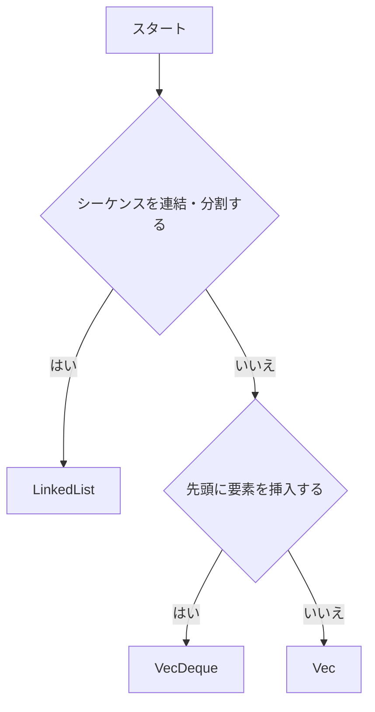

# Sequence Flowchart

以下は、どのシーケンスを選択すべきかを表したフローチャートである。

```mermaid
flowchart TD
  A[スタート] --> B{シーケンスを連結・分割する}
  B --> |はい| C[LinkedList]
  B --> |いいえ| D{先頭に要素を挿入する}
  D --> |はい| E[VecDeque]
  D --> |いいえ| F[Vec]
```
